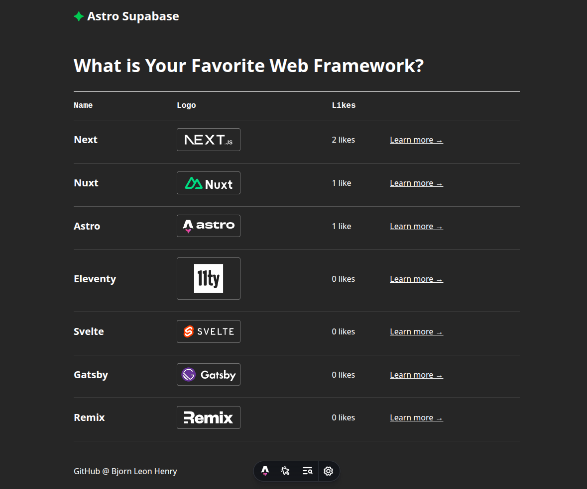

# Astro Supabase Starter# Astro Supabase Starter





A modern web application starter template that demonstrates how to integrate **Supabase** into an **Astro** project. This template provides a solid foundation for building full-stack web applications with a modern tech stack.A modern web application starter template that demonstrates how to integrate **Supabase** into an **Astro** project. This template provides a solid foundation for building full-stack web applications with a modern tech stack.


## Features## Features


- ⚡ **Astro** - Modern static site generator with excellent performance- ⚡ **Astro** - Modern static site generator with excellent performance

- 🗄️ **Supabase** - Open source Firebase alternative with PostgreSQL database- 🗄️ **Supabase** - Open source Firebase alternative with PostgreSQL database

- 🎨 **TypeScript** - Type-safe development experience- 🎨 **TypeScript** - Type-safe development experience

- 📱 **Responsive Design** - Mobile-first approach- 📱 **Responsive Design** - Mobile-first approach

- 🔄 **API Routes** - Built-in API endpoints for data operations- 🔄 **API Routes** - Built-in API endpoints for data operations

- 🎯 **SEO Optimized** - Meta tags and structured data included- 🎯 **SEO Optimized** - Meta tags and structured data included


## Astro Commands## Astro Commands


All commands are run from the root of the project, from a terminal:All commands are run from the root of the project, from a terminal:


| Command                   | Action                                           || Command                   | Action                                           |

| :------------------------ | :----------------------------------------------- || :------------------------ | :----------------------------------------------- |

| `npm install`             | Installs dependencies                            || `npm install`             | Installs dependencies                            |

| `npm run dev`             | Starts local dev server at `localhost:4321`      || `npm run dev`             | Starts local dev server at `localhost:4321`      |

| `npm run build`           | Build your production site to `./dist/`          || `npm run build`           | Build your production site to `./dist/`          |

| `npm run preview`         | Preview your build locally, before deploying     || `npm run preview`         | Preview your build locally, before deploying     |

| `npm run astro ...`       | Run CLI commands like `astro add`, `astro check` || `npm run astro ...`       | Run CLI commands like `astro add`, `astro check` |

| `npm run astro -- --help` | Get help using the Astro CLI                     || `npm run astro -- --help` | Get help using the Astro CLI                     |


## Getting Started## Developing Locally


### Prerequisites| Prerequisites                                                                |

| :--------------------------------------------------------------------------- |

| Requirement                                                                  || [Node.js](https://nodejs.org/) v18.14+                                       |

| :--------------------------------------------------------------------------- || (optional) [nvm](https://github.com/nvm-sh/nvm) for Node version management  |

| [Node.js](https://nodejs.org/) v18.14+                                       || [Netlify account](https://netlify.com/)                                      |

| (optional) [nvm](https://github.com/nvm-sh/nvm) for Node version management  || [Netlify CLI](https://docs.netlify.com/cli/get-started/).                    |

| [Supabase account](https://supabase.com/)                                    || [Supabase account](https://supabase.com/)                                    |


### Database Setup### Set up the database


To use this template, you'll need to set up and seed a new Supabase database:To use this template, you’ll need to set up and seed a new Supabase database.


1. **Create a new Supabase project** at [supabase.com](https://supabase.com)1. Create a new Supabase project.

2. **Run the database migrations**: Execute the SQL commands found in the `supabase/migrations` directory in the Supabase SQL Editor2. Run the SQL commands found in the `supabase/migrations` directory in the Supabase UI.

3. **Seed with sample data**: Import the contents of the `supabase/seed.csv` file using the Supabase Table Editor3. To seed the database with data, you can import the contents of the `supabase/seed.csv` file in the Supabase UI.

4. **Configure environment variables**: Create a `.env` file in the root directory and add your Supabase credentials:

ℹ️ _Note: This template was created to be used with the Supabase extension for Netlify. If you don’t wish to use the Netlify Supabase extension, you will need to set the `SUPABASE_DATABASE_URL` and `SUPABASE_ANON_KEY` environment variables in the `.env` file._

```env

SUPABASE_URL=your-supabase-project-url### Install and run locally

SUPABASE_ANON_KEY=your-supabase-anon-key

```1. Clone this repository, then run `npm install` in its root directory.


### Installation and Development2. For the starter to have full functionality locally, please ensure you have an up-to-date version of Netlify CLI. Run:


1. **Clone the repository**:```

```bashnpm install netlify-cli@latest -g

git clone https://github.com/bjornleonhenry/astro-supabase.git```

cd astro-supabase

```3. Link your local repository to the deployed Netlify site. This will ensure you're using the same runtime version for both local development and your deployed site.


2. **Install dependencies**:```

```bashnetlify link

npm install```

```

4. Then, run the Astro.js development server via Netlify CLI:

3. **Start the development server**:

```bash```

npm run devnetlify dev --target-port 4321

``````


4. **Open your browser** and navigate to [http://localhost:4321](http://localhost:4321)If your browser doesn't navigate to the site automatically, visit [localhost:8888](http://localhost:8888).


## Deployment## Support


This project can be deployed to any static hosting platform that supports Node.js:If you get stuck along the way, get help in our [support forums](https://answers.netlify.com/).


- **Vercel**: Connect your GitHub repository for automatic deployments
- **GitHub Pages**: Use GitHub Actions for automated deployments
- **Cloudflare Pages**: Connect your repository for edge deployments
- **Any static host**: Build with `npm run build` and deploy the `dist` folder

## Project Structure

```
/
├── public/              # Static assets
├── src/
│   ├── components/      # Reusable Astro components
│   ├── content/         # Content collections
│   ├── pages/           # File-based routing
│   │   └── api/         # API endpoints
│   ├── styles/          # Global CSS
│   └── utils/           # Utility functions
├── supabase/
│   ├── migrations/      # Database schema
│   ├── seed.csv         # Sample data
│   └── types.ts         # TypeScript types
└── package.json
```

## Contributing

1. Fork the repository
2. Create your feature branch (`git checkout -b feature/amazing-feature`)
3. Commit your changes (`git commit -m 'Add some amazing feature'`)
4. Push to the branch (`git push origin feature/amazing-feature`)
5. Open a Pull Request

## License

This project is open source and available under the [MIT License](LICENSE).